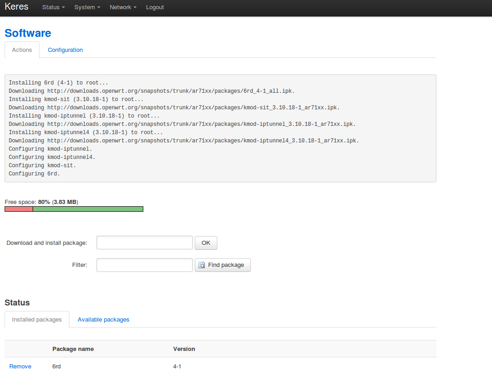

How to use OpenWRT Barrier Breaker r38886 for 6rd
=================================================
This guide shows how to configure OpenWRT Barrier Breaker r38886 / Luci
Trunk (svn-r9934) for 6rd. This was tested the 23rd of November 2013 with the
ISP Tele2 in Sweden.

Prerequisite is that OpenWRT Barrier Breaker is installed and configured for
IPv4 with internet access.

```
**HINT**
When I first installed OpenWRT on my TP-Link TL-WDR4300 I installed the
Attitude Adjustment 12.09 release which was the latest stable release. I set
up IPv4 connectivity, Wifi and Ethernet. *IMPORTANT* when later on upgrading to
Bleeding Edge the luci webinterface will NOT be installed by default so you
must activate SSH connection to the router BEFORE you upgrade.

(The Barrier Breaker installation might enable SSH during configuration if you
have forgotten to do that but I havn't confirmed that that's the case.
```

### Installation of 6rd package
1. Log in to the web interface for your router.
2. Go to System -> Software
3. If needed update package list.
4. In the text field "Download and install package" write "6rd" and press OK.
5. A short console log will show up and show the progress. Afterwards "6rd" will
show in the list of "Installed Packages".

