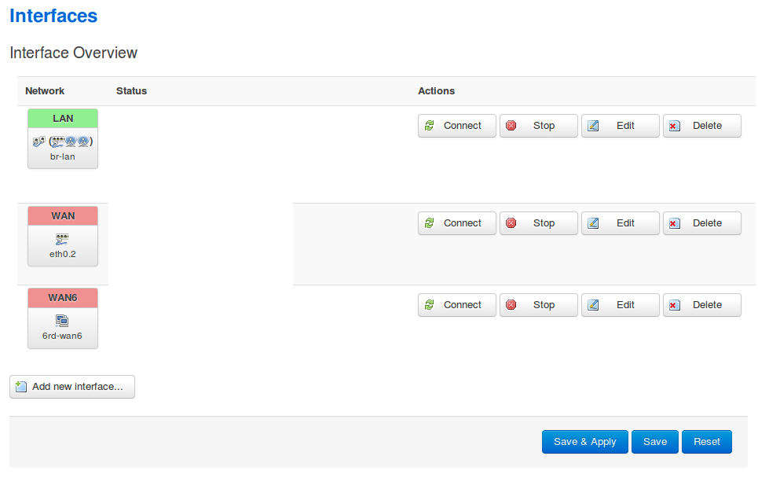
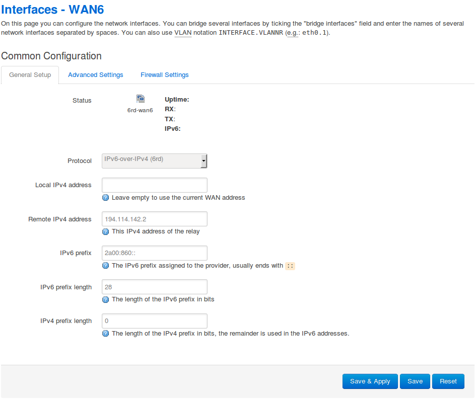

6rd with OpenWRT Barrier Breaker r38886
=======================================
This guide shows how to configure OpenWRT Barrier Breaker r38886 / Luci
Trunk (svn-r9934) for 6rd. This was tested the 23rd of November 2013 with the
ISP Tele2 in Sweden (ipv6.tele2.net).

Prerequisite is that OpenWRT Barrier Breaker is installed and configured for
IPv4 with internet access. The package "luci-proto-ipv6" will give you some
IPv6 settings through the webinterface but initial configuration of 6rd
done below was done through SSH.

### Installation of 6rd package
1. Log in to the web interface for your router.
2. Go to System -> Software
3. If needed update package list.
4. In the text field "Download and install package" write "6rd" and press OK.
5. A short console log will show up and show the progress. Afterwards "6rd" will
show in the list of "Installed Packages".

6. Log in to your router through SSH
7. ```vim /etc/config/network```
8. Add the following information to the file if you have Tele2 as ISP. (wan6
interface is new but the lan interface just need to be updated, at least that
was the case for me).

```
config 'interface' 'wan6'
    option 'proto' '6rd'
    option peeraddr '194.114.142.2'
    option ip6prefix '2a00:860::'
    option ip6prefixlen '28'
    option ip4prefixlen '0'

config 'interface' 'lan'
    option 'proto' 'static'
    option ip6assign 60
```
9. Reboot your router, I did a cold reboot (10 seconds without power).
10. Go to ```Network -> Interfaces```.
11. A new interface should now be visible which is named "wan6".

12. If you press the "Edit" button corresponding to the WAN6 interface you should
see something like the following image.


### Notes
When I first installed OpenWRT on my TP-Link TL-WDR4300 I installed the
Attitude Adjustment 12.09 release which was the latest stable release. I set
up IPv4 connectivity, Wifi and Ethernet. When later on upgrading to
Barrier Breaker the luci webinterface was NOT installed by default so you
must activate SSH connection to the router BEFORE you upgrade.

The Barrier Breaker installation might enable SSH during configuration if you
have forgotten to do that or installing it from the beginning and not upgrading
from Attitude Adjustment, but I havn't confirmed that that's the case.
